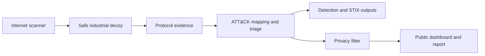

# OT Sentinel

**I built OT Sentinel as a safe, simulated industrial-system honeypot that records suspicious activity and turns it into an easy-to-read security dashboard.**

[](https://github.com/Afnan16312/ot-sentinel-ics-honeypot/actions/workflows/ci.yml)
[](https://www.python.org/)
[](https://attack.mitre.org/matrices/ics/)

> **Honest data notice:** The dashboard currently uses clearly labeled, computer-generated demonstration data. It proves the complete system works, but it is not presented as real attacker activity. Real observations can be added later after an authorized collection period and privacy review.

## Project author

OT Sentinel is my OT/ICS security research project.

**Mir Afnan Ali** · [GitHub profile](https://github.com/Afnan16312) · [Project repository](https://github.com/Afnan16312/ot-sentinel-ics-honeypot)

## What I built

Factories, power plants and water facilities use industrial control systems (ICS) to operate equipment. Exposing a real control system to the internet would be unsafe, so I created OT Sentinel to provide harmless decoys that look like common industrial devices.

My system then:

1. Listens for traffic aimed at simulated Modbus, S7 and IEC-104 services.
2. Records what was attempted without controlling any real equipment.
3. Describes the behavior using MITRE ATT&CK for ICS, a well-known security framework.
4. Removes sensitive details before anything is made public.
5. Displays trends, locations, techniques and sessions in an interactive dashboard.
6. Exports portable STIX intelligence and tested Sigma, Suricata and Wazuh rules.
7. Prioritizes stronger events with an explainable risk score and review queue.

## Why it matters

OT/ICS security protects services people depend on, including electricity, water, ports and manufacturing. I chose this project to develop practical skills in secure system design, industrial network protocols, threat analysis, privacy engineering, cloud deployment, automated testing and security reporting.

The repository includes the complete source code, a working dashboard, automated tests, deployment files and a five-page [demonstration research report](output/pdf/ot-sentinel-demonstration-report.pdf).

I also documented how OT Sentinel compares with established honeypot projects and which practical security features should come next in the [competitive analysis and roadmap](docs/COMPETITIVE_ANALYSIS_AND_ROADMAP.md).

## What is included in version 0.2

| Feature | Plain-language purpose |
|---|---|
| Stateful device profiles | Three fictional water, power and port scenarios respond consistently without controlling equipment |
| Detection rules | Ready-to-review examples for Sigma, Suricata and Wazuh |
| STIX 2.1 export | Moves sanitized findings into a standard threat-intelligence format |
| Triage and validation | Shows which sessions deserve attention and why, then measures mapper agreement against labeled examples |
| Health and alerts | Records sensor health and can send only redacted, high-confidence notifications |
| Multi-sensor collector | Accepts authenticated events from isolated sensors over encrypted transport |
| Release evidence | Produces an SPDX software bill of materials and SHA-256 file checksums |

## Try the dashboard

You need Python 3.12 or newer.

On Windows, open PowerShell in the project folder and run the included launcher:

```powershell
.\run_dashboard.ps1
```

The launcher creates the local environment, installs anything missing and starts the dashboard. If Windows blocks local PowerShell scripts, use:

```powershell
powershell -ExecutionPolicy Bypass -File .\run_dashboard.ps1
```

On Linux or macOS, run:

```bash
python -m venv .venv
source .venv/bin/activate
pip install -r requirements.txt
streamlit run app.py
```

Streamlit opens the dashboard in your browser with the included demonstration data.

## Run the honeypot locally

```bash
pip install -e .
python -m ot_sentinel.sensor --profile profiles/water-treatment.yaml
```

It listens on safe local test ports:

| Simulated service | Local port | Standard Docker/cloud port |
|---|---:|---:|
| Modbus/TCP | 1502 | 502 |
| Siemens S7 / ISO-on-TCP | 1102 | 102 |
| IEC-104 | 2404 | 2404 |

Docker users can run the complete sensor with:

```bash
docker compose up -d --build
docker compose logs -f
```

## How the pieces connect



I designed the ATT&CK mapper to be intentionally cautious. A simple connection is not called an exploit. Stronger labels are added only when the recorded command provides supporting evidence, and every label includes a confidence level and explanation.

## My safety and ethics rules

- The honeypot never connects to a real PLC, HMI or industrial process.
- Responses are limited, simulated and designed not to become a general-purpose server.
- The project does not retaliate, identify people or make attribution claims.
- Raw IP addresses and payloads are excluded from the public repository.
- The included Azure design limits exposed ports, uses SSH keys and supports complete cleanup.
- This is research tooling, not proof of NESA compliance or a production security control.

Read [ETHICS.md](docs/ETHICS.md) before any public deployment.

## Cost

I designed the project so it can be developed and demonstrated locally for free. GitHub, Docker, Python and Streamlit's local server are free. A public cloud sensor may cost money unless student credits or another free credit are available. My [deployment guide](docs/DEPLOYMENT.md) explains a zero-out-of-pocket route and how to remove cloud resources before credits expire.

## Test the project

```bash
pip install -e .
python -m pytest -q -p no:cacheprovider
python -m ruff check .
python scripts/validate_detections.py
python scripts/validate_public_data.py data/demo_events.jsonl
```

The public-data check helps prevent accidental publication of raw IP addresses, raw payloads or unlabeled demonstration records.

Other useful commands:

```bash
ot-sentinel validate-profile profiles/water-treatment.yaml
ot-sentinel evaluate-mapper --fixtures tests/fixtures/evaluation/mapper_cases.jsonl
export OT_PRIVACY_SALT='replace-with-a-private-random-value'
ot-sentinel export-stix data/demo_events.jsonl artifacts/public-stix.json --profile public
```

## Repository guide

| Location | Purpose |
|---|---|
| `app.py` | Interactive Streamlit dashboard |
| `src/ot_sentinel/` | Honeypot, protocol parsers, ATT&CK mapper and privacy tools |
| `profiles/` | Validated fictional water, power and port device profiles |
| `detections/` | Sigma, Suricata and Wazuh detection content plus fixtures |
| `data/` | Clearly labeled synthetic demonstration events |
| `tests/` | Automated unit and integration tests |
| `infra/` | Docker, Azure and Linux service deployment assets |
| `docs/` | Architecture, ethics, data and deployment explanations |
| `docs/PROJECT_WALKTHROUGH.md` | Simple step-by-step explanation and demonstration guide |
| `docs/OPERATIONS.md` | Health, alerting and authenticated collector instructions |
| `docs/DETECTION_ENGINEERING.md` | Detection logic, testing and deployment notes |
| `docs/STIX_EXPORT.md` | Public and private STIX export rules |
| `docs/COMPETITIVE_ANALYSIS_AND_ROADMAP.md` | Project comparison and zero-cost improvement plan |
| `output/pdf/` | Demonstration threat-intelligence report |

## Important limitations

IP location is approximate, a cloud region is only the sensor's location, and honeypot results depend on exposure time and realism. ATT&CK mappings are analyst hypotheses, not proof of compromise or attacker identity. These limitations are shown in the dashboard and report.

## License

The project code is available under the MIT License. MITRE ATT&CK is a registered trademark of The MITRE Corporation.
