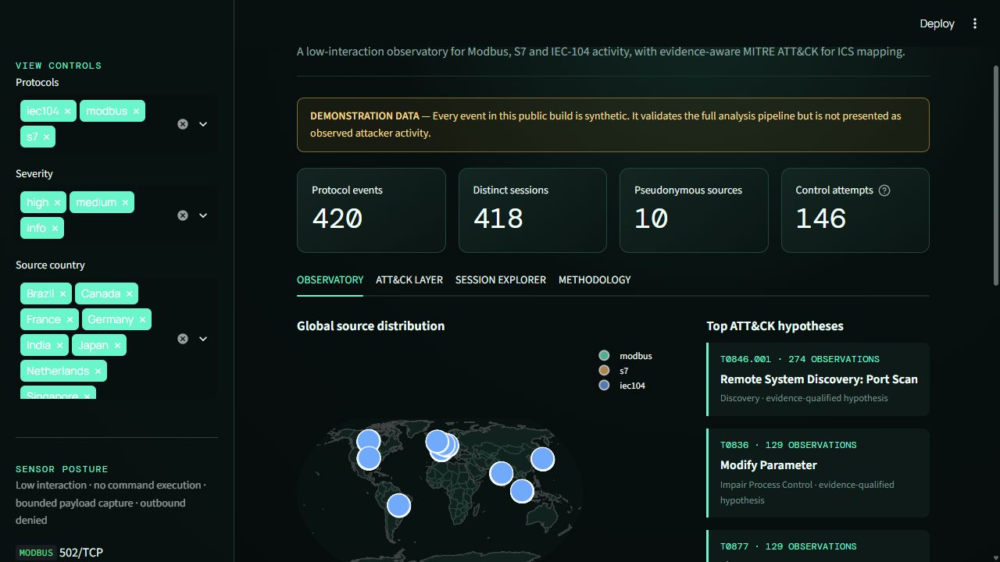
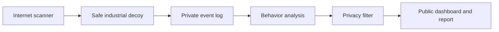

# OT Sentinel

**A safe, simulated industrial-system honeypot that records suspicious activity and turns it into an easy-to-read security dashboard.**

[](https://github.com/Afnan16312/ot-sentinel-ics-honeypot/actions/workflows/ci.yml)
[](https://www.python.org/)
[](https://attack.mitre.org/matrices/ics/)

> **Honest data notice:** The dashboard currently uses clearly labeled, computer-generated demonstration data. It proves the complete system works, but it is not presented as real attacker activity. Real observations can be added later after an authorized collection period and privacy review.



## What does this project do?

Factories, power plants and water facilities use industrial control systems (ICS) to operate equipment. Exposing a real control system to the internet would be unsafe, so OT Sentinel creates harmless decoys that look like common industrial devices.

The project then:

1. Listens for traffic aimed at simulated Modbus, S7 and IEC-104 services.
2. Records what was attempted without controlling any real equipment.
3. Describes the behavior using MITRE ATT&CK for ICS, a well-known security framework.
4. Removes sensitive details before anything is made public.
5. Displays trends, locations, techniques and sessions in an interactive dashboard.

## Why it matters

OT/ICS security protects services people depend on, including electricity, water, ports and manufacturing. This project demonstrates practical skills in secure system design, network protocols, threat analysis, privacy engineering, cloud deployment, automated testing and clear reporting.

## What recruiters can review

- A working three-protocol honeypot written in Python
- A dashboard with a world map, timeline, ATT&CK heat layer and session explorer
- Privacy controls that hide IP addresses and remove raw payloads
- Automated tests, including a real socket-level Modbus test
- Docker and Azure deployment files
- A five-page [demonstration research report](output/pdf/ot-sentinel-demonstration-report.pdf)
- Clear [architecture](docs/ARCHITECTURE.md), [ethics](docs/ETHICS.md) and [deployment](docs/DEPLOYMENT.md) documentation

## Try the dashboard

You need Python 3.12 or newer. In a terminal, run:

```bash
python -m venv .venv
# Windows: .venv\Scripts\activate
# Linux or macOS: source .venv/bin/activate
pip install -r requirements.txt
streamlit run app.py
```

Streamlit opens the dashboard in your browser with the included demonstration data.

## Run the honeypot locally

```bash
pip install -e .
python -m ot_sentinel.sensor
```

It listens on safe local test ports:

| Simulated service | Local port | Standard Docker/cloud port |
|---|---:|---:|
| Modbus/TCP | 1502 | 502 |
| Siemens S7 / ISO-on-TCP | 1102 | 102 |
| IEC-104 | 2404 | 2404 |

Docker users can run the complete sensor with:

```bash
docker compose up -d --build
docker compose logs -f
```

## How the pieces connect



The ATT&CK mapper is intentionally cautious. A simple connection is not called an exploit. Stronger labels are added only when the recorded command provides supporting evidence, and every label includes a confidence level and explanation.

## Safety and ethics

- The honeypot never connects to a real PLC, HMI or industrial process.
- Responses are limited, simulated and designed not to become a general-purpose server.
- The project does not retaliate, identify people or make attribution claims.
- Raw IP addresses and payloads are excluded from the public repository.
- The included Azure design limits exposed ports, uses SSH keys and supports complete cleanup.
- This is research tooling, not proof of NESA compliance or a production security control.

Read [ETHICS.md](docs/ETHICS.md) before any public deployment.

## Cost

Everything can be developed and demonstrated locally for free. GitHub, Docker, Python and Streamlit's local server are free. A public cloud sensor may cost money unless you have student credits or another free credit. The [deployment guide](docs/DEPLOYMENT.md) explains a zero-out-of-pocket route and how to remove cloud resources before credits expire.

## Test the project

```bash
pip install -e .
python -m unittest discover -s tests -v
python scripts/validate_public_data.py data/demo_events.jsonl
```

The public-data check helps prevent accidental publication of raw IP addresses, raw payloads or unlabeled demonstration records.

## Repository guide

| Location | Purpose |
|---|---|
| `app.py` | Interactive Streamlit dashboard |
| `src/ot_sentinel/` | Honeypot, protocol parsers, ATT&CK mapper and privacy tools |
| `data/` | Clearly labeled synthetic demonstration events |
| `tests/` | Automated unit and integration tests |
| `infra/` | Docker, Azure and Linux service deployment assets |
| `docs/` | Architecture, ethics, data and deployment explanations |
| `output/pdf/` | Demonstration threat-intelligence report |

## Important limitations

IP location is approximate, a cloud region is only the sensor's location, and honeypot results depend on exposure time and realism. ATT&CK mappings are analyst hypotheses, not proof of compromise or attacker identity. These limitations are shown in the dashboard and report.

## License

The project code is available under the MIT License. MITRE ATT&CK is a registered trademark of The MITRE Corporation.
