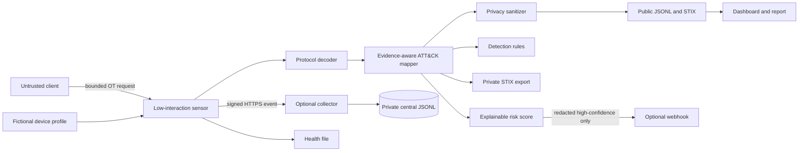

# Architecture

OT Sentinel separates untrusted collection, private analysis and public presentation. The Internet-facing component is deliberately small, low interaction and unable to execute uploaded content.

## Trust boundaries

1. **Untrusted network:** arbitrary clients can reach only the emulated ICS listeners.
2. **Sensor:** reads at most 512 bytes per session, closes idle connections and never executes received content.
3. **Simulation state:** profiles are validated against a small allow-list and modify only in-memory fictional registers.
4. **Private storage:** raw IP addresses and bounded payloads remain in ignored private logs.
5. **Remote collection:** each sensor has its own secret; events are timestamped, HMAC signed and sent over HTTPS. Replay and identity checks occur before storage.
6. **Publication pipeline:** source addresses become salted pseudonyms, payloads and credential-like fields are removed, and public STIX is checked again.
7. **Public presentation:** the dashboard consumes sanitized observations or explicitly labeled demonstration data.

## ATT&CK evidence model

Mappings are hypotheses, not automatic attribution:

| Evidence | Mapping | Confidence |
|---|---|---|
| TCP connection only | None | N/A |
| Protocol-aware device probe | T0846.001 | Medium |
| Modbus state read | T0877 | Low |
| Write/control request | T1692.001, T0836 | High / Medium |
| Controller program transfer | T0843 | High |
| Documented exploit signature | T0866 | High |

The risk score uses protocol action, evidence strength, mapping confidence, repetition and novelty. It never uses geography or identity and is not proof of attacker intent, attribution or compromise.

## Failure containment

- Alert and collector delivery use bounded queues and retries; failures do not block protocol listeners.
- Alerts are deduplicated and contain no source IP address or raw payload.
- Collector timestamps, event identifiers and signatures are checked before append-only storage.
- Health output records parser errors, queue drops, delivery failures and last-event time.
- Public datasets, STIX bundles and release evidence are created through repeatable local commands.

## Collector assurance

The optional collector intentionally exposes only `POST /v1/events` and `GET /health`. Its contract is published as [OpenAPI 3.1](api/collector.openapi.json), and synthetic black-box tests exercise authentication, freshness, identity, replay, malformed framing, concurrency, timeouts, storage failure, privacy-safe errors and shutdown through real loopback sockets.

The design remains framework-free because two machine endpoints do not currently justify the dependency and operational surface of Flask or Django. See [ADR-020](ADR_020_COLLECTOR_FRAMEWORK.md), the [collector threat model](COLLECTOR_THREAT_MODEL.md) and [collector hardening guide](COLLECTOR_HARDENING.md).
