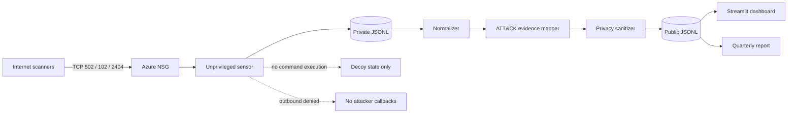

# Architecture

OT Sentinel separates untrusted collection from public analysis. The Internet-facing component is deliberately small, low interaction, and unable to execute uploaded content.

## Trust boundaries

1. **Untrusted network:** arbitrary Internet clients can reach only three emulated ICS ports.
2. **Sensor:** reads a maximum of 512 bytes per session and closes idle connections after eight seconds.
3. **Raw storage:** contains source IPs and bounded payloads; it stays private and is excluded by `.gitignore`.
4. **Publication pipeline:** replaces source IPs with salted pseudonyms, removes payloads and strips credential-like fields.
5. **Public presentation:** consumes only sanitized observations or explicitly synthetic demonstrations.

## ATT&CK evidence model

Mappings are hypotheses, not automatic attribution:

| Evidence | Mapping | Confidence |
|---|---|---|
| TCP connection only | None | N/A |
| Protocol-aware device probe | T0846.001 | Medium |
| Modbus state read | T0877 | Low |
| Write/control request | T1692.001, T0836 | High / Medium |
| Controller program transfer | T0843 | High |
| Documented exploit signature | T0866 | High |

This avoids the common but incorrect practice of labeling every connection as exploitation.

