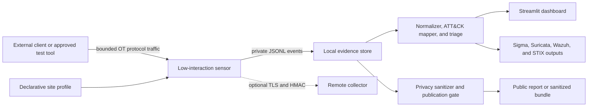
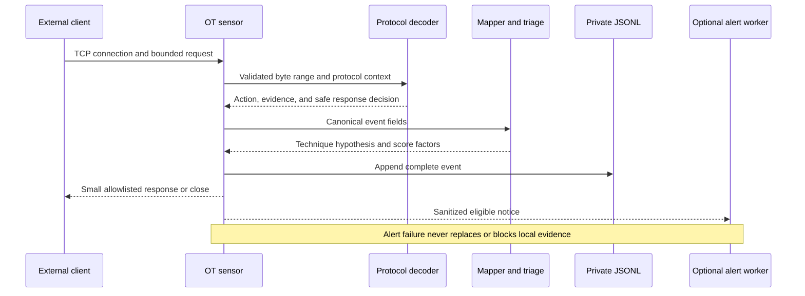
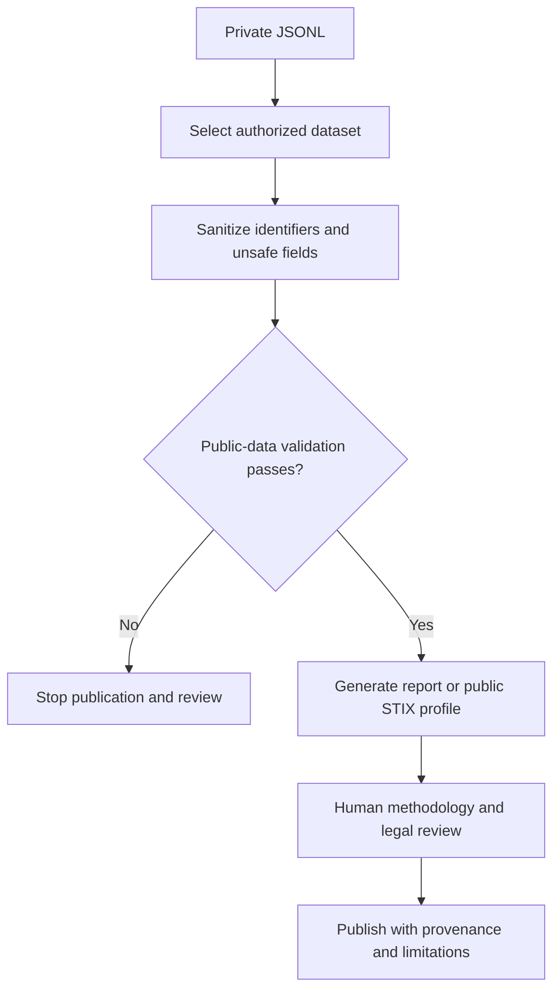
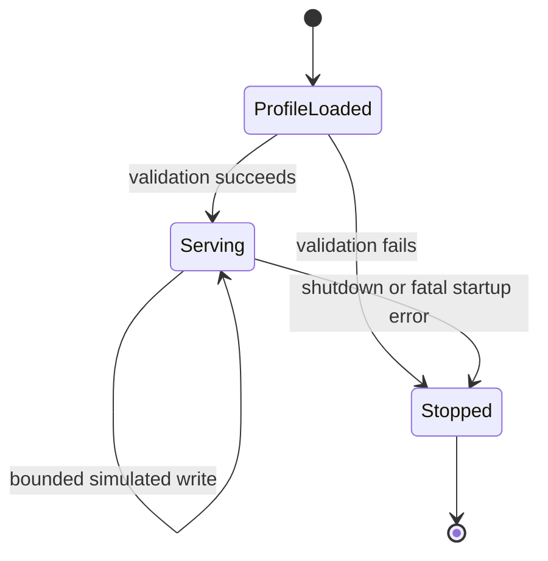

# System Design

## 1. Purpose

OT Sentinel is a low-interaction industrial-control honeypot and analysis workbench. It safely simulates selected Modbus/TCP, Siemens S7comm, and IEC-104 behaviors; records structured evidence; maps only supported behavior to MITRE ATT&CK for ICS; and presents the result in a local dashboard or portable defender formats.

The design prioritizes safety, explainability, privacy, low operating cost, and reproducibility. It does not attempt to control a physical process, fully reproduce a PLC, identify a person, or prove that a mapped technique caused a compromise.

## 2. System context

## 3. Component design

| Component | Responsibility | Main inputs | Main outputs | Failure posture |
|---|---|---|---|---|
| Protocol listeners | Accept bounded connections and dispatch protocol decoding | TCP bytes, limits, selected profile | Parsed request or safe rejection | Timeout, cap, log, and close |
| Protocol decoders | Extract selected Modbus, S7, and IEC-104 evidence | Bounded byte string | Protocol action and evidence fields | Treat malformed input as untrusted; never execute it |
| Safe responder | Return small allowlisted protocol-shaped replies | Decoded safe request, in-memory profile state | Response bytes | Unsupported behavior receives no privileged action |
| Event model/writer | Create the canonical record | Session context, decoder output | Append-only JSONL | Local evidence remains primary if integrations fail |
| Profile loader | Validate simulated site identity and state | JSON profile | Bounded runtime configuration | Reject invalid keys, values, or structure |
| Normalizer | Convert supported external log forms | Conpot or native record | Canonical event | Preserve uncertainty when source evidence is incomplete |
| ATT&CK mapper | Attach reviewed technique hypotheses | Canonical event evidence | Technique, confidence, rationale | Leave unmapped when evidence is insufficient |
| Triage scorer | Prioritize review | Protocol evidence and mapping | Score, label, factor list | Deterministic result; no identity/geography factor |
| Evaluation harness | Detect mapping regressions | Labeled cases and mapper output | Confusion counts and metrics | Clearly scope results to fixtures |
| Privacy layer | Prepare public-safe artifacts | Private canonical events | Sanitized events or validation error | Fail closed on forbidden public content |
| STIX exporter | Produce portable intelligence | Mapped, profile-appropriate events | STIX 2.1 bundle | Reject invalid profile/data combination |
| Operations layer | Expose health and deliver optional alerts | Counters and selected events | Health metrics, webhook messages | Capped queues, retry limits, local evidence unaffected |
| Remote transport | Authenticate central ingestion | Signed envelope over TLS | Verified central event | Reject stale, oversized, unsigned, or replayed input |
| Dashboard | Explain the selected dataset | JSONL events and evaluation cases | Five interactive analysis tabs | Read-only analysis; source file is unchanged |

## 4. Collection sequence

## 5. Publication sequence

## 6. Canonical event model

The event is the contract between collection, analysis, visualization, and export. The exact field definitions are in [DATA_DICTIONARY.md](DATA_DICTIONARY.md). The important groups are:

| Group | Examples | Reason |
|---|---|---|
| Provenance | event ID, timestamp, dataset type, sensor/profile | Distinguish synthetic, test, and authorized live evidence |
| Network/session | protocol, source, destination, session ID, request number | Reconstruct bounded interactions |
| Decoded behavior | action, function/type code, address, value, parser evidence | Support protocol-aware analysis |
| Analysis | severity, ATT&CK technique, confidence, rationale, triage factors | Make conclusions explainable |
| Safety/privacy | truncation state, sanitization state, publication profile | Enforce evidence boundaries |

Raw payload material is minimized and bounded. Public artifacts replace or remove sensitive network and payload fields.

## 7. Simulated state model

Site profiles are JSON documents selected at startup. A profile can provide a fictional facility name, protocol identity, and bounded initial values. Supported writes alter only an in-memory dictionary owned by the process.

There is no physical output, programmable-logic execution, arbitrary file write, user-provided code hook, or state persistence after restart.

## 8. Interfaces

### Network interfaces

- The three sensor ports are configurable. Unprivileged demo defaults avoid requiring administrator rights.
- Optional remote collection uses HTTPS/TLS and signed envelopes rather than unauthenticated forwarding.
- Optional webhook output carries a redacted summary, not raw payload evidence.
- The Streamlit UI is intended for localhost by default. Public exposure requires separate authentication, TLS, and network controls.

### File interfaces

- `profiles/*.yaml`: declarative, JSON-compatible simulation inputs.
- `data/*.jsonl`: local evidence or explicitly labeled demonstration data.
- `tests/fixtures/`: fixed regression inputs, never live observations.
- `detections/`: versioned defender content.
- `reports/`: generated research artifacts with provenance labels.

### Command interfaces

The command-line package starts sensor and analysis functions; scripts generate demo data, validate public data and detections, build reports, and check release evidence. The Windows launcher handles local dashboard environment setup.

## 9. Trust boundaries and controls

| Boundary | Main threats | Controls |
|---|---|---|
| Internet to listener | Malformed data, resource exhaustion, exploit attempts | Low privileges, caps, timeouts, bounded reads, no execution, container/service hardening |
| Profile file to runtime | Malicious or invalid configuration | Schema-style validation, no hooks, bounded values |
| Sensor to local disk | Log injection, disk growth, evidence loss | Structured serialization, size controls, retention guidance, local-first evidence |
| Sensor to webhook | Sensitive-data leakage, blocking, alert storm | Redaction, selection threshold, capped queue, deduplication, timeout/retry |
| Sensor to collector | Spoofing, tampering, replay, interception | TLS, HMAC, timestamp window, replay cache, request-size limit |
| Private to public data | Privacy leak, misleading provenance | Sanitization, fail-closed validator, explicit dataset label, human review |
| Code to release artifact | Dependency or build compromise | Pinning, dependency review, CodeQL, container scanning, SBOM, checksums, provenance |

See [THREAT_MODEL.md](THREAT_MODEL.md) for threat detail and [ETHICS.md](ETHICS.md) for the operator's legal and ethical responsibilities.

## 10. Failure behavior

- A malformed message is recorded with limited safe evidence and the connection is closed or ignored according to protocol handling.
- A slow client reaches a timeout; a noisy client reaches request/session caps.
- An invalid profile prevents startup rather than silently weakening controls.
- An alert destination failure causes bounded retries and metrics; it does not remove the JSONL record.
- A stale, oversized, incorrectly signed, or replayed collector request is rejected.
- A public artifact with forbidden fields fails validation and must not be published.
- An unmapped event stays unmapped instead of receiving a guessed ATT&CK technique.

## 11. Deployment modes

| Mode | Cost | Use | Important controls |
|---|---:|---|---|
| Local Windows | No service fee | Development, interview demo, analysis | Localhost UI; non-admin ports; Windows launcher |
| Local Docker | No service fee beyond the computer | Isolation and reproducible demo | Non-root container, read-only filesystem, dropped capabilities, limits |
| Linux service | Host-dependent | Controlled lab or authorized sensor | Dedicated account, firewall, log rotation, service hardening |
| Optional Azure VM | Paid unless covered by a credit/free allowance | Time-bounded authorized regional collection | Budget alert, NSG allowlist/ports, no management UI exposure, retention and shutdown plan |
| Oracle Always Free sensor | Expected AED 0 while eligible and within allowance | Active isolated regional collection | Dedicated VCN/NSG, SSH `/32`, non-root container, host egress guard, systemd and log rotation |
| Optional central collector | Host-dependent | Multiple controlled sensors | TLS certificates, HMAC secret rotation, clock and replay monitoring |

No cloud resource is required to build, test, run or demonstrate the project. The Oracle sensor is a separate private research deployment; its raw data is not used by the public dashboard.

## 12. Capacity and scaling

The implementation uses explicit connection, request, payload, queue, retry, and replay-cache limits. These bounds make behavior predictable on a small host. The repository does **not** claim a production throughput number because no standardized load benchmark is part of `v0.2.0`.

For a larger authorized deployment, run separate sensor instances, forward sanitized/verified records to a central store, rotate local evidence, and benchmark the exact host and traffic profile before setting capacity targets.

## 13. Test and assurance design

- Unit tests cover protocol parsing, mapping, triage, privacy, profiles, operations, transport, STIX, detections, evaluation, and supply-chain invariants.
- Integration tests open real local sockets against the sensor and exercise safe protocol flows.
- Deterministic fixtures cover expected and rejected mapping/detection cases.
- CI runs the suite and policy validators on every relevant change.
- CodeQL, dependency review, secret scanning, and container scanning provide complementary automated evidence.
- Release automation produces an SBOM and checksums for artifact inspection.

Current passing fixture metrics indicate agreement with the curated regression set only; they are not a scientific measurement of attacker classification accuracy.

## 14. Known limitations and next design steps

- No authorized public live-collection dataset has been published.
- The sensor is intentionally low interaction and implements selected protocol behaviors only.
- Suricata, Sigma CLI, and Wazuh engine-native validation must run in destination environments.
- The dashboard is a local analysis tool, not an authenticated multi-user SOC platform.
- Technique coverage is conservative and limited by decoded evidence.
- Continuous monitoring, cost review, collection shutdown, legal/privacy review and report publication remain operator activities.

The future-work requirements and their evidence conditions are listed in [PRODUCT_REQUIREMENTS_AND_TRACEABILITY.md](PRODUCT_REQUIREMENTS_AND_TRACEABILITY.md).
